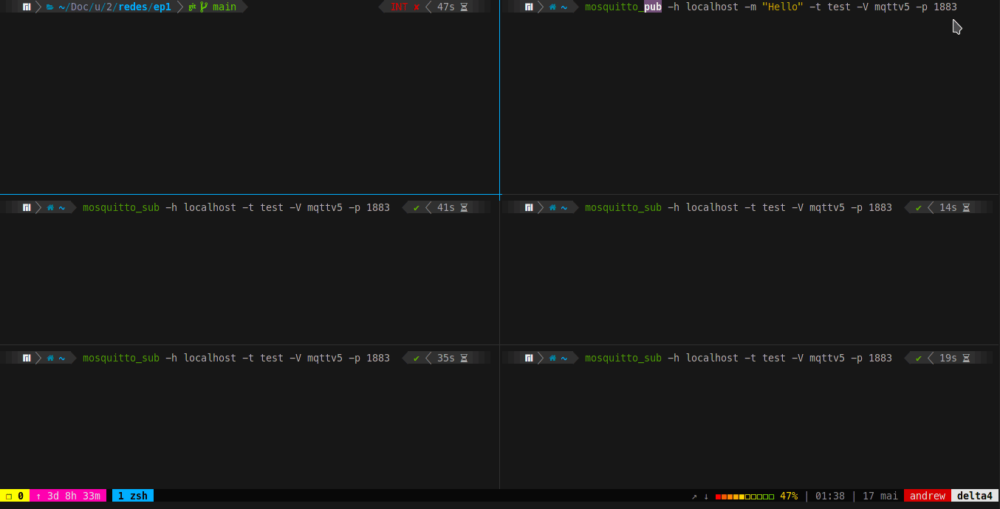
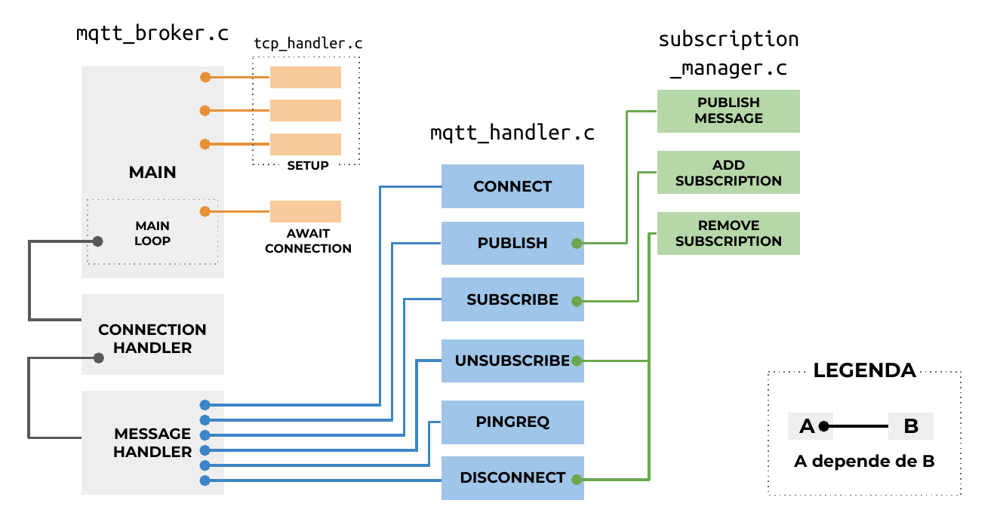

# MQTT broker

A simplified MQTT 5.0 broker, made for the subject MAC0352 - Computer Network and Distributed Systems. MQTT is a publish-subscribe network protocol used in Internet of Things (IoT) devices.

<br/>
<p align="center">
    
</p>
<br/>

## Architecture

The [MQTT 5.0 protocol](https://docs.oasis-open.org/mqtt/mqtt/v5.0/mqtt-v5.0.html) is huge. This project just implements a simplified version of it. See the [presentation slides](docs/slides.pdf) (in Portuguese) for more information about project decisions. 

<br/>
<p align="center">
    
</p>
<br/>


## Installation

Just run

```
    make
```

Execute `make clean` to remove object files.

## Usage

Run the executable `mqtt_broker` passing the port `<port>`:

```
    ./mqtt_broker <port>
```

For example, to run the broker on port 1883, execute:

```
    ./mqtt_broker 1883
```

You can use clients `mosquitto_sub` and `mosquitto_pub` from the Debian package [`mosquitto-clients`](https://packages.debian.org/bullseye/mosquitto-clients) to interact with the broker.

## License

Licensed under the MIT license.
